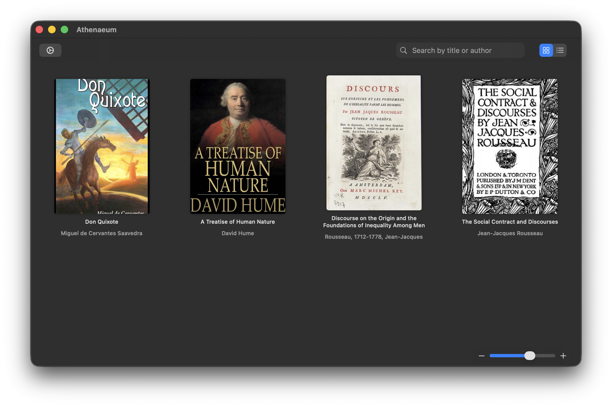
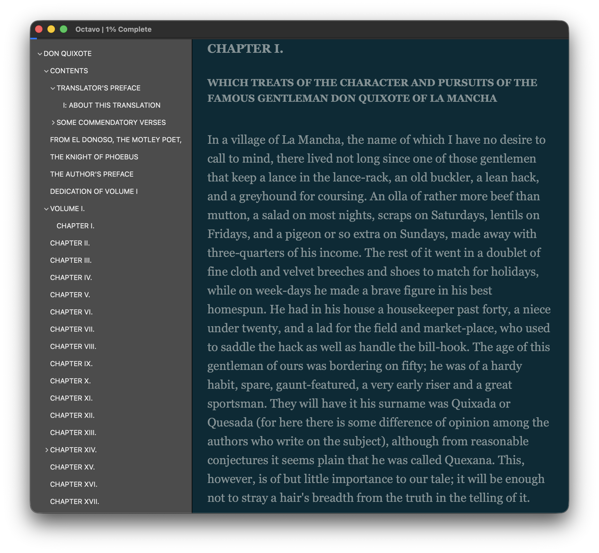
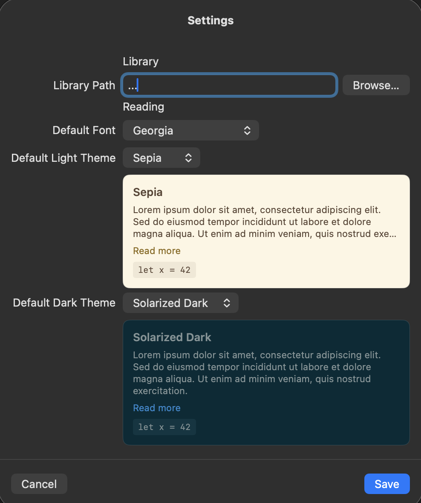

# Athenaeum

A macOS EPUB reader and library manager built with Swift and SwiftUI. Zero external dependencies.



## Apps

- **Athenaeum** — Personal book library. Import, browse, search, and manage your EPUB collection. Grid and table views, metadata editing, cover art, and configurable theme palettes.
- **Octavo** — Standalone EPUB reader. Open files via file picker or drag-and-drop, navigate chapters, customize fonts and zoom, and cycle between light, dark, and system themes.

## Features

### Reader
- EPUB 2 (NCX) and EPUB 3 (nav) table of contents support
- Chapter and page navigation with keyboard shortcuts (left/right arrow keys)
- Customizable font family and page zoom
- 10 named theme palettes (5 light, 5 dark) with three-mode toggle: light / dark / system
- Collapsible table of contents sidebar
- Auto-hiding toolbar and navigation bar for distraction-free reading
- Reading progress indicator with per-chapter page counting
- Scroll position memory across chapters



### Library
- Import EPUBs with automatic metadata and cover extraction
- Duplicate import prevention (same title + author)
- Grid view with cover thumbnails or table view with sortable columns
- Search by title or author
- Edit metadata and replace cover art
- Configurable default light and dark themes with color previews
- Localized for English, Spanish, and Italian



## Requirements

- macOS 13.0+
- Swift 5.9+
- [xcodegen](https://github.com/yonaskolb/XcodeGen) (for generating the Xcode project)

## Build & Run

### Xcode (recommended)

```sh
xcodegen generate        # Generate Athenaeum.xcodeproj from project.yml
open Athenaeum.xcodeproj # Open in Xcode, select Athenaeum or Octavo scheme
```

### Command line

```sh
swift build            # Build all targets
swift run Octavo       # Run the EPUB reader
swift run Athenaeum    # Run the library app
```

## Project Structure

```
Athenaeum/       # Library app (com.alleato.athenaeum)
Octavo/          # EPUB reader app (com.alleato.octavo)
Forma/          # Shared UI library: reader views, theme management
Ligature/        # Shared backend library: EPUB parsing, core models
docs/            # Documentation
project.yml      # Xcode project spec (xcodegen)
```

Both app targets depend on **Forma**, which depends on **Ligature**. SQLite is linked only by the Athenaeum target.

See [docs/ARCHITECTURE.md](docs/ARCHITECTURE.md) for detailed architecture documentation.

## Naming

- **Athenaeum** — from the Latin *athenaeum*, a place for reading and scholarly pursuit. The library/catalog app.
- **Octavo** — a traditional book size format where pages are folded into eighths. The standalone EPUB reader.
- **Forma** — Latin for form or shape. The shared UI layer giving visual form to the reading experience.
- **Ligature** — a typographic term for joined characters. The shared backend library connecting both apps.

## Contributing

See [CONTRIBUTING.md](CONTRIBUTING.md) for guidelines.

## License

This project is licensed under the MIT License. See [LICENSE](LICENSE) for details.
